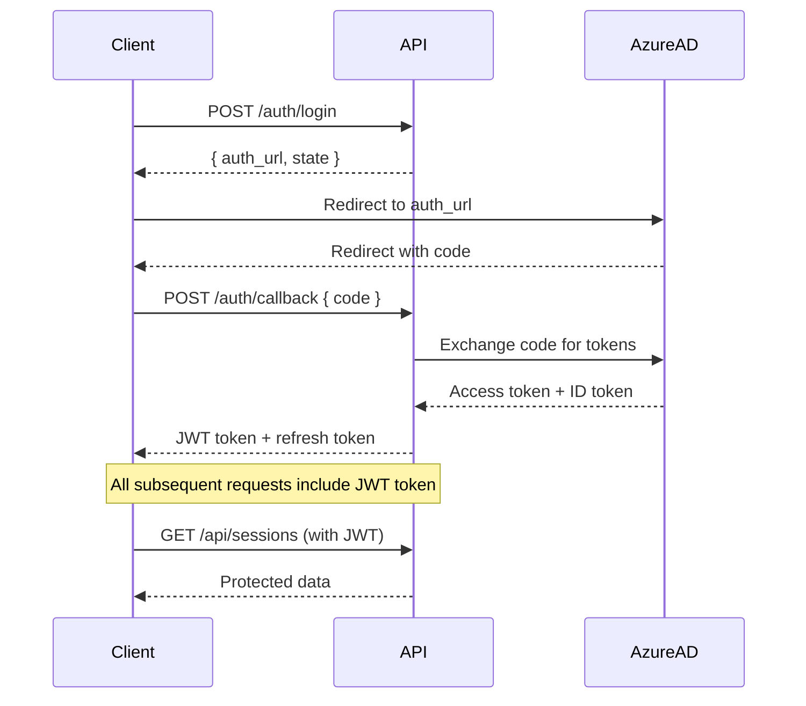

# Magentic-UI API Documentation

## Overview

The Magentic-UI API provides secure endpoints for managing AI agent sessions, conversations, and team collaborations. All endpoints require authentication via Azure AD and JWT tokens.

## Authentication

### Authentication Flow



### Authentication Endpoints

#### POST /auth/login
Initiate the Azure AD authentication flow.

**Request:**
```json
{
  "redirect_url": "https://your-app.com/dashboard" // optional
}
```

**Response:**
```json
{
  "auth_url": "https://login.microsoftonline.com/...",
  "state": "random-state-string"
}
```

#### POST /auth/callback
Exchange authorization code for JWT tokens.

**Request:**
```json
{
  "code": "authorization-code-from-azure",
  "state": "state-from-login-request"
}
```

**Response:**
```json
{
  "access_token": "jwt-token",
  "token_type": "bearer",
  "expires_in": 3600,
  "refresh_token": "refresh-token",
  "user": {
    "id": "user-id",
    "email": "user@company.com",
    "name": "User Name",
    "roles": ["user"]
  }
}
```

#### POST /auth/refresh
Refresh an expired access token.

**Request:**
```json
{
  "refresh_token": "current-refresh-token"
}
```

**Response:**
```json
{
  "access_token": "new-jwt-token",
  "token_type": "bearer",
  "expires_in": 3600
}
```

#### POST /auth/logout
Invalidate current session and tokens.

**Headers:**
```
Authorization: Bearer <jwt-token>
```

**Response:**
```json
{
  "message": "Successfully logged out"
}
```

## API Endpoints

### Sessions Management

#### GET /api/sessions
List all sessions for the authenticated user.

**Headers:**
```
Authorization: Bearer <jwt-token>
```

**Query Parameters:**
- `limit` (integer, optional): Number of sessions to return (default: 50)
- `offset` (integer, optional): Number of sessions to skip (default: 0)
- `status` (string, optional): Filter by session status (`active`, `completed`, `error`)

**Response:**
```json
{
  "status": true,
  "data": [
    {
      "id": 1,
      "name": "AI Research Session",
      "description": "Researching AI trends",
      "status": "active",
      "created_at": "2024-06-14T10:30:00Z",
      "updated_at": "2024-06-14T11:45:00Z",
      "user_id": "user-123",
      "metadata": {
        "tags": ["research", "ai"],
        "priority": "high"
      }
    }
  ],
  "pagination": {
    "total": 25,
    "limit": 50,
    "offset": 0,
    "has_more": false
  }
}
```

#### POST /api/sessions
Create a new session.

**Headers:**
```
Authorization: Bearer <jwt-token>
Content-Type: application/json
```

**Request:**
```json
{
  "name": "New Research Session",
  "description": "Exploring quantum computing applications",
  "metadata": {
    "tags": ["quantum", "computing"],
    "priority": "medium"
  }
}
```

**Response:**
```json
{
  "status": true,
  "data": {
    "id": 2,
    "name": "New Research Session",
    "description": "Exploring quantum computing applications",
    "status": "active",
    "created_at": "2024-06-14T12:00:00Z",
    "updated_at": "2024-06-14T12:00:00Z",
    "user_id": "user-123",
    "metadata": {
      "tags": ["quantum", "computing"],
      "priority": "medium"
    }
  },
  "message": "Session created successfully"
}
```

#### GET /api/sessions/{session_id}
Get details of a specific session.

**Headers:**
```
Authorization: Bearer <jwt-token>
```

**Path Parameters:**
- `session_id` (integer): Unique identifier of the session

**Response:**
```json
{
  "status": true,
  "data": {
    "id": 1,
    "name": "AI Research Session",
    "description": "Researching AI trends",
    "status": "active",
    "created_at": "2024-06-14T10:30:00Z",
    "updated_at": "2024-06-14T11:45:00Z",
    "user_id": "user-123",
    "metadata": {
      "tags": ["research", "ai"],
      "priority": "high"
    },
    "runs": [
      {
        "id": 1,
        "status": "completed",
        "created_at": "2024-06-14T10:30:00Z",
        "completed_at": "2024-06-14T10:45:00Z"
      }
    ]
  }
}
```

#### PUT /api/sessions/{session_id}
Update an existing session.

**Headers:**
```
Authorization: Bearer <jwt-token>
Content-Type: application/json
```

**Request:**
```json
{
  "name": "Updated Session Name",
  "description": "Updated description",
  "status": "completed",
  "metadata": {
    "tags": ["research", "ai", "completed"],
    "priority": "low"
  }
}
```

**Response:**
```json
{
  "status": true,
  "data": {
    "id": 1,
    "name": "Updated Session Name",
    "description": "Updated description",
    "status": "completed",
    "updated_at": "2024-06-14T12:30:00Z"
  },
  "message": "Session updated successfully"
}
```

#### DELETE /api/sessions/{session_id}
Delete a session and all associated data.

**Headers:**
```
Authorization: Bearer <jwt-token>
```

**Response:**
```json
{
  "status": true,
  "message": "Session deleted successfully"
}
```

### Runs Management

#### GET /api/sessions/{session_id}/runs
Get all runs for a specific session.

**Headers:**
```
Authorization: Bearer <jwt-token>
```

**Response:**
```json
{
  "status": true,
  "data": [
    {
      "id": 1,
      "session_id": 1,
      "status": "completed",
      "task": "Research latest AI developments",
      "team_result": {
        "summary": "Found 15 relevant papers on transformer architectures",
        "key_findings": [
          "New attention mechanisms show 20% improvement",
          "Efficiency gains in large model training"
        ]
      },
      "created_at": "2024-06-14T10:30:00Z",
      "completed_at": "2024-06-14T10:45:00Z",
      "metadata": {
        "model_used": "gpt-4",
        "tokens_consumed": 2500
      }
    }
  ]
}
```

#### POST /api/runs
Create and execute a new run.

**Headers:**
```
Authorization: Bearer <jwt-token>
Content-Type: application/json
```

**Request:**
```json
{
  "session_id": 1,
  "task": "Analyze competitor landscape for AI startups",
  "team_config": {
    "team_type": "research",
    "agents": ["researcher", "analyst", "summarizer"],
    "max_iterations": 5
  },
  "metadata": {
    "priority": "high",
    "deadline": "2024-06-15T18:00:00Z"
  }
}
```

**Response:**
```json
{
  "status": true,
  "data": {
    "id": 2,
    "session_id": 1,
    "status": "running",
    "task": "Analyze competitor landscape for AI startups",
    "created_at": "2024-06-14T13:00:00Z",
    "estimated_completion": "2024-06-14T13:15:00Z"
  },
  "message": "Run started successfully"
}
```

#### GET /api/runs/{run_id}
Get details and progress of a specific run.

**Headers:**
```
Authorization: Bearer <jwt-token>
```

**Response:**
```json
{
  "status": true,
  "data": {
    "id": 2,
    "session_id": 1,
    "status": "running",
    "task": "Analyze competitor landscape for AI startups",
    "progress": {
      "current_step": "Research phase",
      "completion_percentage": 60,
      "steps_completed": 3,
      "total_steps": 5
    },
    "created_at": "2024-06-14T13:00:00Z",
    "messages": [
      {
        "timestamp": "2024-06-14T13:02:00Z",
        "agent": "researcher",
        "content": "Starting competitive analysis research",
        "type": "status"
      }
    ]
  }
}
```

### Teams Management

#### GET /api/teams
List available team configurations.

**Headers:**
```
Authorization: Bearer <jwt-token>
```

**Response:**
```json
{
  "status": true,
  "data": [
    {
      "id": "research-team",
      "name": "Research Team",
      "description": "Specialized team for research tasks",
      "agents": [
        {
          "role": "researcher",
          "capabilities": ["web_search", "paper_analysis", "data_extraction"]
        },
        {
          "role": "analyst",
          "capabilities": ["data_analysis", "pattern_recognition", "insights"]
        },
        {
          "role": "summarizer",
          "capabilities": ["text_summarization", "report_generation"]
        }
      ],
      "default_config": {
        "max_iterations": 5,
        "collaboration_mode": "sequential"
      }
    }
  ]
}
```

#### GET /api/teams/{team_id}
Get detailed configuration for a specific team.

**Headers:**
```
Authorization: Bearer <jwt-token>
```

**Response:**
```json
{
  "status": true,
  "data": {
    "id": "research-team",
    "name": "Research Team",
    "description": "Specialized team for research tasks",
    "agents": [
      {
        "role": "researcher",
        "model": "gpt-4",
        "system_prompt": "You are a research specialist...",
        "capabilities": ["web_search", "paper_analysis"],
        "tools": ["bing_search", "arxiv_search"]
      }
    ],
    "orchestration": {
      "type": "sequential",
      "max_iterations": 5,
      "timeout_minutes": 30
    }
  }
}
```

### Settings Management

#### GET /api/settings
Get user settings and preferences.

**Headers:**
```
Authorization: Bearer <jwt-token>
```

**Response:**
```json
{
  "status": true,
  "data": {
    "user_preferences": {
      "theme": "dark",
      "language": "en",
      "timezone": "UTC",
      "notifications": {
        "email": true,
        "push": false,
        "run_completion": true
      }
    },
    "api_limits": {
      "max_sessions": 100,
      "max_runs_per_hour": 50,
      "max_tokens_per_day": 100000
    },
    "integrations": {
      "azure_openai": {
        "enabled": true,
        "endpoint": "https://your-openai.openai.azure.com/"
      }
    }
  }
}
```

#### PUT /api/settings
Update user settings.

**Headers:**
```
Authorization: Bearer <jwt-token>
Content-Type: application/json
```

**Request:**
```json
{
  "user_preferences": {
    "theme": "light",
    "notifications": {
      "email": false,
      "run_completion": true
    }
  }
}
```

**Response:**
```json
{
  "status": true,
  "message": "Settings updated successfully"
}
```

## WebSocket API

### Connection

Connect to WebSocket for real-time updates:

```javascript
const ws = new WebSocket('wss://your-domain.com/api/ws?token=jwt-token');
```

### Events

#### Run Progress Updates

```json
{
  "type": "run_progress",
  "data": {
    "run_id": 2,
    "status": "running",
    "progress": {
      "completion_percentage": 75,
      "current_step": "Analysis phase",
      "estimated_time_remaining": 300
    }
  }
}
```

#### Agent Messages

```json
{
  "type": "agent_message",
  "data": {
    "run_id": 2,
    "agent": "researcher",
    "message": "Found 25 relevant competitor companies",
    "timestamp": "2024-06-14T13:10:00Z"
  }
}
```

#### Run Completion

```json
{
  "type": "run_completed",
  "data": {
    "run_id": 2,
    "status": "completed",
    "team_result": {
      "summary": "Comprehensive competitor analysis completed",
      "deliverables": ["competitor_matrix.json", "analysis_report.pdf"]
    },
    "completed_at": "2024-06-14T13:15:00Z"
  }
}
```

## Error Handling

### Standard Error Response

```json
{
  "status": false,
  "error": {
    "code": "VALIDATION_ERROR",
    "message": "Request validation failed",
    "details": {
      "field": "session_id",
      "issue": "Session not found or access denied"
    }
  }
}
```

### Error Codes

| Code | HTTP Status | Description |
|------|-------------|-------------|
| `AUTHENTICATION_REQUIRED` | 401 | JWT token missing or invalid |
| `ACCESS_DENIED` | 403 | User lacks permission for resource |
| `RESOURCE_NOT_FOUND` | 404 | Requested resource doesn't exist |
| `VALIDATION_ERROR` | 422 | Request data validation failed |
| `RATE_LIMIT_EXCEEDED` | 429 | API rate limit exceeded |
| `INTERNAL_ERROR` | 500 | Unexpected server error |
| `SERVICE_UNAVAILABLE` | 503 | External service dependency down |

### Authentication Errors

```json
{
  "status": false,
  "error": {
    "code": "TOKEN_EXPIRED",
    "message": "JWT token has expired",
    "details": {
      "expired_at": "2024-06-14T12:00:00Z",
      "refresh_required": true
    }
  }
}
```

## Rate Limiting

### Limits

- **Authentication endpoints**: 10 requests per minute per IP
- **Standard API endpoints**: 100 requests per minute per user
- **WebSocket connections**: 5 concurrent connections per user
- **File uploads**: 10 MB per request, 100 MB per hour per user

### Rate Limit Headers

```
X-RateLimit-Limit: 100
X-RateLimit-Remaining: 95
X-RateLimit-Reset: 1640995200
X-RateLimit-Retry-After: 60
```

## SDKs and Integration

### Python SDK Example

```python
import requests
from typing import Dict, Optional

class MagenticUIClient:
    def __init__(self, base_url: str, token: str):
        self.base_url = base_url
        self.headers = {
            'Authorization': f'Bearer {token}',
            'Content-Type': 'application/json'
        }
    
    def create_session(self, name: str, description: str) -> Dict:
        """Create a new session"""
        response = requests.post(
            f'{self.base_url}/api/sessions',
            json={'name': name, 'description': description},
            headers=self.headers
        )
        return response.json()
    
    def start_run(self, session_id: int, task: str) -> Dict:
        """Start a new run in a session"""
        response = requests.post(
            f'{self.base_url}/api/runs',
            json={'session_id': session_id, 'task': task},
            headers=self.headers
        )
        return response.json()

# Usage
client = MagenticUIClient('https://your-domain.com', 'your-jwt-token')
session = client.create_session('Research Session', 'AI trends research')
run = client.start_run(session['data']['id'], 'Research transformer architectures')
```

### JavaScript SDK Example

```javascript
class MagenticUIClient {
    constructor(baseUrl, token) {
        this.baseUrl = baseUrl;
        this.headers = {
            'Authorization': `Bearer ${token}`,
            'Content-Type': 'application/json'
        };
    }

    async createSession(name, description) {
        const response = await fetch(`${this.baseUrl}/api/sessions`, {
            method: 'POST',
            headers: this.headers,
            body: JSON.stringify({ name, description })
        });
        return response.json();
    }

    async connectWebSocket(token) {
        const ws = new WebSocket(`${this.baseUrl.replace('http', 'ws')}/api/ws?token=${token}`);
        
        ws.onmessage = (event) => {
            const data = JSON.parse(event.data);
            this.handleWebSocketMessage(data);
        };
        
        return ws;
    }

    handleWebSocketMessage(data) {
        switch (data.type) {
            case 'run_progress':
                console.log('Run progress:', data.data);
                break;
            case 'agent_message':
                console.log('Agent message:', data.data);
                break;
        }
    }
}

// Usage
const client = new MagenticUIClient('https://your-domain.com', 'your-jwt-token');
const session = await client.createSession('Research Session', 'AI trends research');
const ws = await client.connectWebSocket('your-jwt-token');
```

## Testing

### Authentication Testing

```bash
# Test login flow
curl -X POST "https://your-domain.com/api/auth/login" \
  -H "Content-Type: application/json" \
  -d '{"redirect_url": "https://your-app.com/dashboard"}'

# Test token refresh
curl -X POST "https://your-domain.com/api/auth/refresh" \
  -H "Content-Type: application/json" \
  -d '{"refresh_token": "your-refresh-token"}'
```

### API Testing

```bash
# Test session creation
curl -X POST "https://your-domain.com/api/sessions" \
  -H "Authorization: Bearer your-jwt-token" \
  -H "Content-Type: application/json" \
  -d '{"name": "Test Session", "description": "API testing"}'

# Test run creation
curl -X POST "https://your-domain.com/api/runs" \
  -H "Authorization: Bearer your-jwt-token" \
  -H "Content-Type: application/json" \
  -d '{"session_id": 1, "task": "Test task"}'
```

## Changelog

### v1.0.0 (2024-06-14)
- Initial API release with Azure AD authentication
- Session and run management endpoints
- Real-time WebSocket support
- Rate limiting and security features

### Upcoming Features
- Bulk operations for sessions and runs
- Advanced search and filtering
- Webhook support for external integrations
- Enhanced team configuration options
- API versioning support

This documentation provides a comprehensive guide to the Magentic-UI API with full authentication integration and security features.
