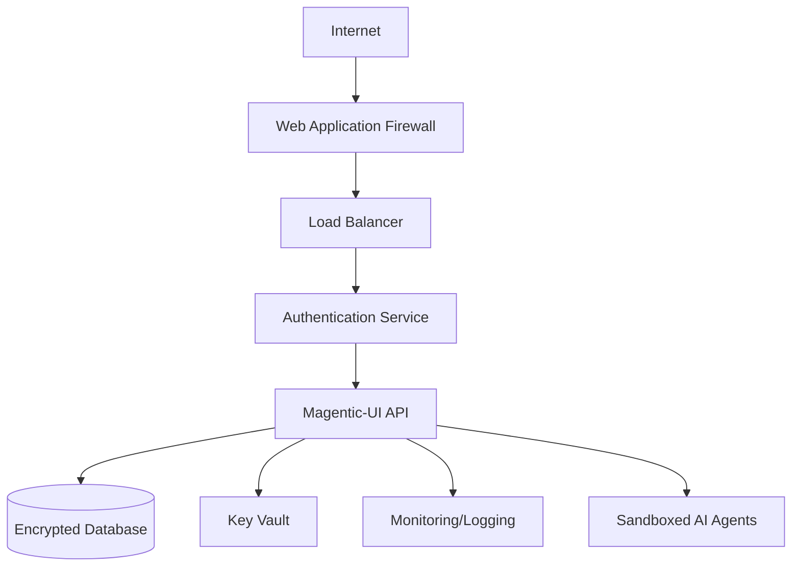

# Magentic-UI Security Analysis for Online Deployment

## 🚨 **Current Security Status: NOT READY for Public Internet Deployment**

Magentic-UI in its current form has significant security vulnerabilities that make it **unsafe for public internet deployment**. This analysis covers the security risks and provides recommendations for secure deployment.

---

## 🔍 **Critical Security Issues Identified**

### 1. **No Authentication/Authorization System**
❌ **HIGH RISK**
- Application uses a default guest user (`guestuser@gmail.com`) 
- No user registration, login, or session management
- Anyone can access any user's data by changing the `user_id` parameter
- API endpoints accept `user_id` as query parameter without validation

**Evidence:**
```python
# src/magentic_ui/backend/web/config.py
DEFAULT_USER_ID: str = "guestuser@gmail.com"

# API endpoints accept user_id without authentication
@router.get("/")
async def list_sessions(user_id: str, db=Depends(get_db)) -> Dict:
    """List all sessions for a user"""
    response = db.get(Session, filters={"user_id": user_id})
```

### 2. **Unrestricted API Access**
❌ **HIGH RISK**
- All API endpoints are publicly accessible
- No rate limiting
- No input validation on user_id parameters
- CORS allows all origins in development mode

**Evidence:**
```python
# src/magentic_ui/backend/web/app.py
app.add_middleware(
    CORSMiddleware,
    allow_origins=[
        "http://localhost:8000",
        "http://127.0.0.1:8000",
        "http://localhost:8001",
        "http://localhost:8081",
    ],
    allow_credentials=True,
    allow_methods=["*"],
    allow_headers=["*"],
)
```

### 3. **Web Agent Security Risks**
⚠️ **MEDIUM-HIGH RISK**
- AI agents can browse the internet and execute code
- Docker sandboxing provides some isolation but not complete protection
- Agents have access to sensitive model endpoints
- No restrictions on what websites agents can access by default

### 4. **Data Privacy Issues**
❌ **HIGH RISK**
- User data stored in local SQLite database without encryption
- Chat history, sensitive information stored in plaintext
- No data retention policies
- No user consent mechanisms

### 5. **File System Access**
⚠️ **MEDIUM RISK**
- Application has file system access for workspaces
- No sandboxing of file operations
- Potential for path traversal attacks

---

## 🛡️ **Security Recommendations for Production**

### **Phase 1: Essential Security (REQUIRED before any public deployment)**

#### 1. **Implement Proper Authentication**
```python
# Required implementations:
- OAuth 2.0 / OpenID Connect integration
- JWT token-based authentication  
- Session management with secure cookies
- Role-based access control (RBAC)
- Multi-factor authentication (MFA)
```

#### 2. **API Security**
```python
# Add authentication middleware
@app.middleware("http")
async def authenticate_request(request: Request, call_next):
    # Validate JWT token
    # Check user permissions
    # Rate limiting
    pass
```

#### 3. **Input Validation & Sanitization**
```python
# Add Pydantic models with validation
class UserRequest(BaseModel):
    user_id: str = Field(..., regex=r'^[a-zA-Z0-9._-]+@[a-zA-Z0-9.-]+\.[a-zA-Z]{2,}$')
    
# SQL injection prevention (currently using ORM, which helps)
# XSS prevention for all user inputs
```

#### 4. **Environment Variable Security**
```bash
# Move all sensitive config to environment variables
AZURE_OPENAI_API_KEY=xxx
DATABASE_ENCRYPTION_KEY=xxx
JWT_SECRET_KEY=xxx
ALLOWED_DOMAINS=example.com,trusted-site.com
```

### **Phase 2: Enhanced Security**

#### 1. **Database Security**
- Migrate from SQLite to PostgreSQL/MySQL with encryption at rest
- Implement database connection pooling
- Add audit logging for all data access
- Regular database backups with encryption

#### 2. **Network Security**
```yaml
# Use HTTPS only
server:
  tls:
    cert_file: /path/to/cert.pem
    key_file: /path/to/key.pem
  
# Implement Web Application Firewall (WAF)
# DDoS protection
# IP whitelisting for admin functions
```

#### 3. **Container Security**
```dockerfile
# Use non-root user
USER 1001

# Read-only file system where possible
RUN chmod -R 755 /app && \
    chown -R 1001:1001 /app

# Security scanning
RUN apt-get update && apt-get install -y --no-install-recommends \
    security-updates
```

#### 4. **Agent Containment**
```python
# Implement strict website allowlists
ALLOWED_WEBSITES = [
    "*.wikipedia.org",
    "*.stackoverflow.com",
    # Only trusted domains
]

# Code execution sandboxing
# File system access restrictions
# Network access limitations
```

### **Phase 3: Production Hardening**

#### 1. **Monitoring & Logging**
```python
# Security event logging
import structlog
logger = structlog.get_logger()

@app.middleware("http") 
async def security_logging(request: Request, call_next):
    logger.info("api_request", 
               user_id=get_user_id(request),
               endpoint=request.url.path,
               ip=request.client.host)
```

#### 2. **Vulnerability Management**
- Regular dependency updates
- Container image scanning
- Penetration testing
- Security code reviews

#### 3. **Data Protection Compliance**
- GDPR compliance (if serving EU users)
- Data retention policies
- Right to deletion implementation
- Privacy policy and terms of service

---

## 🔧 **Immediate Steps for Secure Deployment**

### **Option A: Private/Internal Deployment**
If deploying for internal use only:

1. **Deploy behind VPN/corporate firewall**
2. **Implement basic HTTP authentication**
3. **Restrict network access to trusted IPs**
4. **Use HTTPS with valid certificates**
5. **Regular security updates**

### **Option B: Public Deployment (NOT RECOMMENDED without full security implementation)**
If you must deploy publicly:

1. **Implement all Phase 1 security measures**
2. **Deploy on Azure Container Apps with proper security groups**
3. **Use Azure Key Vault for secrets management**
4. **Enable Azure Application Gateway with WAF**
5. **Implement comprehensive monitoring**

---

## 📋 **Security Checklist**

Before deploying Magentic-UI online, ensure:

- [ ] Authentication system implemented
- [ ] Authorization controls in place  
- [ ] API endpoints secured with tokens
- [ ] Input validation on all user inputs
- [ ] HTTPS enabled with valid certificates
- [ ] Database encrypted and secured
- [ ] Sensitive data stored securely (not in code)
- [ ] Rate limiting implemented
- [ ] Monitoring and alerting configured
- [ ] Security testing completed
- [ ] Incident response plan prepared
- [ ] Backup and recovery procedures tested
- [ ] Compliance requirements met (GDPR, etc.)

---

## ⚖️ **Legal and Compliance Considerations**

1. **Data Protection Laws**
   - GDPR (EU), CCPA (California), PIPEDA (Canada)
   - User consent for data processing
   - Right to deletion and data portability

2. **Terms of Service**
   - Clear usage limitations
   - Liability disclaimers
   - Content policies

3. **AI Ethics and Safety**
   - Responsible AI usage policies
   - Content filtering and moderation
   - Human oversight requirements

---

## 🚀 **Recommended Architecture for Production**



---

## 💡 **Conclusion**

**Magentic-UI is currently a development/research tool and requires significant security hardening before any public deployment.** The application has powerful AI capabilities that could be misused if not properly secured.

**For production use, budget for 3-6 months of security development work** to implement proper authentication, authorization, data protection, and monitoring systems.

**Consider using Magentic-UI in controlled environments first** (internal corporate use, research settings) before attempting public deployment.
